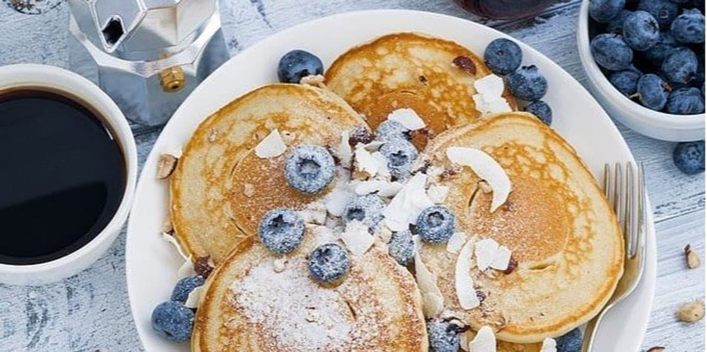

import { Exclusive } from '../../../src/components/exclusive'

You can reward people who support your site by giving web monetized viewers exclusive content.
Here is a component that shows exclusive content only to monetized viewers.

```jsx
import React, { useEffect, useState } from "react"
import "antd/dist/antd.css"
import { Switch } from "antd"

export const Exclusive = ({ children }) => {

  const [visible, setVisible] = useState(false)
  const [alwaysVisible, setAlwaysVisible] = useState(false)

  useEffect(() => {
    if (typeof document !== "undefined") {
      if (document.monetization) {
        document.monetization.addEventListener("monetizationstart", () => {
          setVisible(true)
        })
      }
    }
  }, [])

  return (
    <div>
      <Switch checkedChildren="View as non-monetized user" unCheckedChildren="View as monetized user"
              onChange={() => setAlwaysVisible(!alwaysVisible)} style={{ marginBottom: "10px" }}/>
      <div>
        {(visible || alwaysVisible) && <div>{children}</div>}
      </div>
    </div>
  )
}
```
### Demo
#### Delicios Pancakes - by Vladka Klimyak

##### Ingrediens
* 1.5 l kefir
* 2 cups flour
* 3 tablespoons sugar
* 1 teaspoon baking soda
##### Instructions
Whisk everything together. Pour pancake batter on the pan (with oil) and cook under a lit until pancakes are lightly brown.

<Exclusive>

##### BONUS - Condensed milk topping
##### Ingrediens
* 1 cup milk
* 1.3 cup sugar powder
* 20 g butter
##### Instructions
Let come all ingredients boil on a low heat.
After you have froth on the surface, stir on a high heat for 10 minutes.
Drizzle the pancakes with sweetened condensed milk.
</Exclusive>
