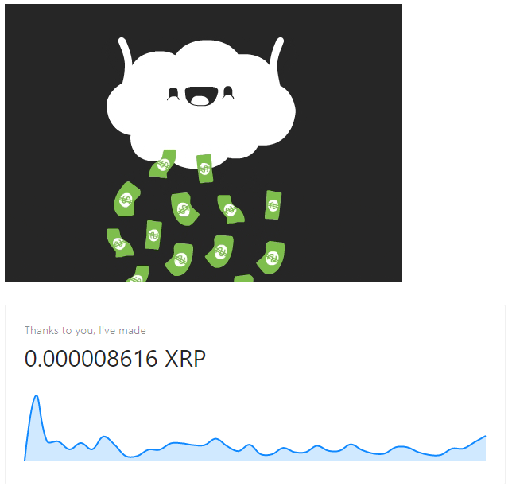

import { Counter } from '../../../src/components/counter'

This example shows you how you can use the `monetizationprogress` event to count how much you've
made off of micropayments from a given visitor.
If you don't have web monetization enabled, this is how it would look like.


```jsx
import React, { useEffect, useState } from "react"
import gif from "../../static/money-rain.gif"
import "antd/dist/antd.css"
import "ant-design-pro/dist/ant-design-pro.css"
import moment from "moment"
import loadable from "@loadable/component"

// ant-design-pro/lib/Charts references 'document' which is not allowed when building Gatsby
// therefore we make use of loadable library
const ChartCard = loadable(() => import('ant-design-pro/lib/Charts/ChartCard'))
const MiniArea = loadable(() => import('ant-design-pro/lib/Charts/MiniArea'))

export const Counter = () => {
  const [formatted, setFormatted] = useState("")
  const [currency, setCurrency] = useState("")
  const [data, setData] = useState([])

  useEffect(() => {
    if (typeof document !== "undefined") {
      let total = 0
      let scale
      if (document.monetization) {
        document.monetization.addEventListener("monetizationprogress", ev => {
          // initialize currency and scale on first progress event
          if (total === 0) {
            scale = ev.detail.assetScale
            setCurrency(ev.detail.assetCode)
          }

          total += Number(ev.detail.amount)
          setData(data => [...data, { x: moment().format("hh:mm:ss:SS"), y: Number(ev.detail.amount) }])
          setFormatted((total * Math.pow(10, -scale)).toFixed(scale))
        })
      }
    }
  }, [])
  const value = formatted ? `${formatted} ${currency}` : "nothing yet"
  return (
    <div>
      {formatted && }
      <ChartCard title="Thanks to you, I've made" total={value} contentHeight={120}>
        <MiniArea line height={100} data={data}/>
      </ChartCard>
    </div>
  )
}
```
### Demo
<Counter/>

